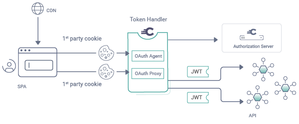

# SPA using Curity's Token Handler Implementation

A Single Page Application (SPA) client that uses the production supported backend components.\
The SPA uses an OAuth Agent to perform an API driven OpenID Connect flow:

The SPA then calls APIs with `HTTP-only SameSite=strict` cookies, in line with [best practices for browser based apps](https://datatracker.ietf.org/doc/html/draft-ietf-oauth-browser-based-apps).

## Architecture Benefits

This provides the best separation of web and API concerns, to maintain all of the benefits of an SPA architecture:

- `Strongest Browser Security` developed by experts
- `Supported Solution`, with design guidance and professional services support
- `Great User Experience` due to the separation of web and API concerns
- `Productive Developer Experience` with only simple security code needed in the SPA
- `Deploy Anywhere`, such as to a Content Delivery Network

## Simple Code in Apps

This repository demonstrates the business focused components you should need to develop:

- A Single Page App coded in React
- A Web Host to provide static content
- An API that validates JWT access tokens

It also provides an example deployment so that you can understand the moving parts.

## Run the End-to-end Flow

The SPA can be quickly run in an end-to-end flow on a development computer by following this guide:

- [Deployment Instructions](/DEPLOYMENT.md)

## Website Documentation

See the following resources for further information and tutorials:

- [Token Handler Product](https://curity.io/product/token-handler/)
- [Create a Token Handler](https://curity.io/resources/learn/curity-token-handler/)
- [SPA Code Example](https://curity.io/resources/learn/token-handler-spa-example/)
- [Deployment Tutorial](https://curity.io/resources/learn/token-handler-deployment-example/)

## More Information

Please visit [curity.io](https://curity.io/) for more information about the Curity Identity Server.

